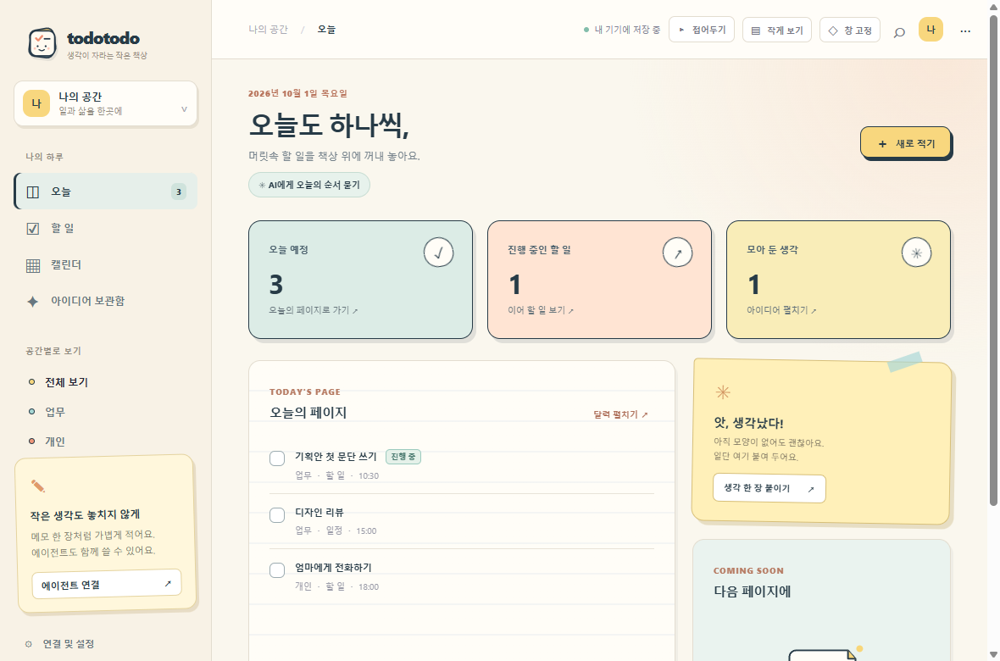
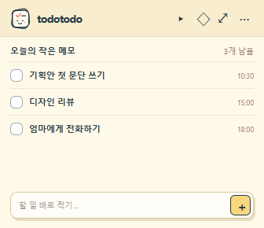

<p align="center"></p>

# TodoTodo

**할 일은 체크하고, 떠오른 생각은 붙여두고. 화면이 복잡해지면 접어두세요.**

TodoTodo는 책상 한쪽에 놓아두는 작은 수첩 같은 Windows 앱입니다. 일정·할 일·아이디어를 한곳에서 다루고, 필요할 때만 Codex나 Claude Desktop에 연결합니다. 가입, 동기화 서버, AI 연결 없이 바로 쓸 수 있습니다.

[**Windows용 다운로드**](https://github.com/sukoji/todotodo/releases/latest) · [화면 미리 보기](docs/screenshot.png)



## 하루에 맞춰 크기를 바꿔요

| 보기 | 쓰임 |
| --- | --- |
| 전체 창 | 할 일, 달력, 아이디어를 정리할 때 |
| 작은 메모 | 오늘 할 일 3개를 보며 바로 적거나 체크할 때 |
| 가장자리 탭 | 화면을 비워두고 로고만 왼쪽·오른쪽에 남길 때 |



기본 Windows 제목 표시줄 없이 앱 헤더나 로고 부분을 잡아 창을 움직입니다. 오른쪽 `···` 메뉴에서 최소화·최대화·닫기를 고릅니다. 창 고정과 투명도(45–100%)를 조절할 수 있습니다. 시간이 있는 일정은 정각 또는 5·10·30분 전에 알림을 보냅니다. 모니터를 옮기거나 해상도가 바뀌면 창을 화면 안으로 맞춥니다. `Ctrl+Shift+M`으로 전체 창과 작은 메모를 전환할 수 있습니다.
창 너비가 좁아지면 로고와 메뉴를 한 줄로 접어 할 일과 일정이 바로 보이도록 배치합니다.
PC가 잠자기에서 돌아온 뒤에도 일정 시작 5분 이내라면 놓친 알림을 전합니다. 이미 보낸 알림은 앱을 다시 켜도 중복 발송하지 않습니다.

`Ctrl+K`를 누르면 업무·개인 공간의 할 일, 일정, 아이디어를 한 번에 찾을 수 있습니다. 검색 결과는 위아래 화살표로 이동하고 Enter로 열 수 있습니다.
에이전트와 앱에서 같은 기록을 동시에 고치면 저장 전에 알려줍니다. 작성하던 초안을 유지하거나 최신 기록을 불러오고, 내 내용으로 덮어쓸지는 직접 선택할 수 있습니다.
할 일은 **시작 전 → 진행 중 → 완료**로 상태를 바꿀 수 있고, 오늘 화면의 요약 카드에서 해당 목록으로 바로 이동합니다.
할 일 목록은 오늘, 지난 날짜, 다가오는 날, 날짜 없음 순서로 보여줍니다. 전체 보기에서는 완료한 일을 맨 아래에 모읍니다.
날짜가 지난 미완료 할 일도 오늘 화면에서 확인하고 마무리할 수 있습니다. 항목에 키보드 초점을 맞춘 뒤 Enter나 Space를 누르면 편집창이 열립니다.
달력에서 월을 넘기면 선택 날짜도 함께 이동합니다. Tab으로 달력에 들어가 방향키로 날짜를 옮길 수 있습니다. 날짜를 고른 뒤 일정을 추가하면 바로 그 날짜로 기록됩니다.
기록할 때는 오늘·내일·날짜 없음 버튼으로 날짜를 빠르게 정할 수 있습니다. 시간을 넣은 기록은 날짜도 함께 선택해야 알림을 받을 수 있습니다.

## AI는 선택 사항이에요

TodoTodo의 기록과 알림은 AI 없이 로컬에서 동작합니다. 연결이 필요할 때는 **연결 및 설정**에서 방법을 고르세요.

| 연결 | 필요한 것 | 하는 일 |
| --- | --- | --- |
| Claude Desktop | 개인 Claude 로그인 + [TodoTodo 확장 파일](https://github.com/sukoji/todotodo/releases/latest) | Claude가 내 로컬 일정과 아이디어를 MCP로 읽고 기록 |
| Codex | 개인 ChatGPT 로그인 + 앱에 표시된 Codex 설정 | GPT 기반 Codex가 같은 로컬 MCP 도구 사용 |
| 앱 안의 AI 브리핑 | 개인 OpenAI 또는 Claude **API 키** | 오늘 일정 제목과 시간만 보내 실행 순서 제안 |

Claude Desktop에서는 **Settings → Extensions → Advanced settings → Install Extension…**에서 `todotodo-claude-win.mcpb`를 선택하세요. Codex에서는 앱의 **연결 및 설정 → Codex**에 표시되는 내용을 `~/.codex/config.toml`에 추가하세요. 두 경우 모두 앱이 실행 중일 필요는 없지만, 같은 컴퓨터의 TodoTodo 데이터 파일을 사용합니다. 이전 버전에서 Codex를 연결했다면 앱에 표시된 설정을 한 번 다시 복사하세요. 그다음부터 설치형은 업데이트해도 실행 파일 경로가 유지됩니다. portable에서 새 MCP 기능을 쓰려면 업데이트 후 표시되는 설정을 다시 복사하세요.

앱 안의 AI 브리핑은 사용자가 버튼을 누를 때만 호출됩니다. API 키는 운영체제 보안 저장소로 암호화하며, 내용 전체나 메모 본문을 자동 전송하지 않습니다. **ChatGPT·Claude 구독은 각 서비스의 API 사용료를 포함하지 않습니다.** ChatGPT 웹사이트에 로컬 앱을 직접 연결하려면 별도의 공개 MCP 연결 또는 터널이 필요합니다. TodoTodo는 이를 대신하는 서버를 운영하지 않습니다.

## 다운로드 후 시작

1. [최신 릴리스](https://github.com/sukoji/todotodo/releases/latest)에서 일반 사용에는 `TodoTodo-*-setup.exe`를 내려받습니다. 설치 없이 쓰려면 `TodoTodo-*-portable.exe`를 고르세요.
2. 설치형은 사용자 계정에 설치하고 시작 메뉴와 바탕화면에 바로가기를 만듭니다. portable은 실행할 때마다 앱 파일을 임시 폴더에 풀어 시작이 더 오래 걸릴 수 있습니다. 두 방식 모두 Python·Node.js는 필요하지 않습니다.
3. 연결 없이 쓰다가 필요할 때만 Claude 확장이나 Codex 설정을 추가하세요.

Windows 배포 파일은 현재 코드 서명이 없습니다. 조직 PC에서는 실행 정책에 따라 차단될 수 있습니다. 배포 파일과 소스는 이 저장소의 릴리스에서 함께 확인할 수 있습니다.

두 실행 방식 모두 데이터는 `%APPDATA%\TodoTodo\todotodo.db`에 저장됩니다. 설치형을 제거해도 기록은 남습니다. 앱을 켜 둔 동안 30분마다 JSON 자동 백업을 갱신하고 최근 7일분을 같은 기기의 `backups` 폴더에 보관합니다. **연결 및 설정**에서 백업 폴더를 열거나, 다른 드라이브에 둘 JSON 백업을 직접 내보낼 수 있습니다. 가져오기는 기존 기록을 유지하고 중복 항목을 건너뜁니다. 계정 동기화, 앱 종료 후 알림, 반복 일정은 아직 없습니다.

## 개발자를 위한 실행 방법

Node.js/npm, Python 3.10+, `uv`가 필요합니다.

```bash
npm install
npm start
```

웹 화면만 실행하려면 `python app.py` 후 <http://127.0.0.1:8765>를 여세요. 소스 실행 시 기본 데이터 파일은 프로젝트 폴더의 `todotodo.db`입니다. `TODOTODO_DB`로 경로를 바꿀 수 있습니다.

MCP 서버만 실행하려면 `uv run python mcp_server.py`를 stdio 서버로 등록하세요. 도구는 `list_entries`, `get_entry`, `capture_entry`, `revise_entry`, `mark_done`, `get_daily_brief`입니다. 웹 API는 `GET/POST /api/items`, `PATCH/DELETE /api/items/{id}`, `GET /api/brief`, `GET /api/export`, `POST /api/import`를 제공합니다.

```bash
npm run check
npm run build:win
```

Windows 배포 빌드는 PyInstaller로 데이터 서버·MCP 서버를 묶고, Electron 설치형·portable 실행 파일과 Claude 확장 파일을 생성합니다. 결과는 `release/`에 저장됩니다.
