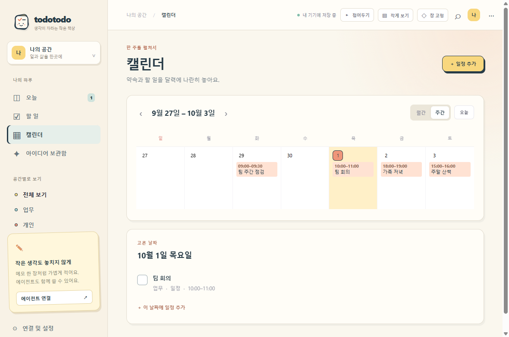
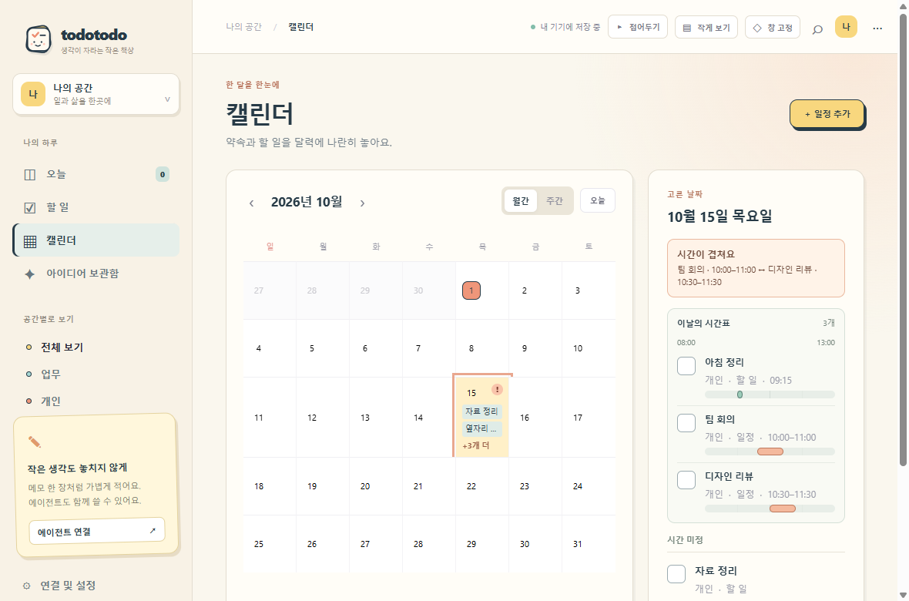

<p align="center"></p>

# TodoTodo

**할 일은 체크하고, 떠오른 생각은 붙여두고. 화면이 복잡해지면 접어두세요.**

TodoTodo는 책상 한쪽에 놓아두는 작은 수첩 같은 Windows 앱입니다. 일정·할 일·아이디어를 한곳에서 다루고, 필요할 때만 Codex나 Claude Desktop에 연결합니다. 가입, 동기화 서버, AI 연결 없이 바로 쓸 수 있습니다.

[**Windows용 다운로드**](https://github.com/sukoji/todotodo/releases/latest) · [화면 미리 보기](docs/screenshot.png)


## 하루에 맞춰 크기를 바꿔요

| 보기 | 쓰임 |
| --- | --- |
| 전체 창 | 할 일, 달력, 아이디어를 정리할 때 |
| 작은 메모 | 오늘 할 일을 훑고 체크하거나 아이디어를 바로 적을 때 |
| 가장자리 탭 | 화면을 비워두고 로고만 왼쪽·오른쪽에 남길 때 |


작은 메모에서도 입력창 위에서 **할 일/아이디어**를 고르고, 왼쪽에서 **개인/업무**를 고르세요. 목록도 선택에 맞춰 바뀝니다. 할 일 쪽에서는 오늘·지난 할 일과 일정을, 아이디어 쪽에서는 최근 메모 30개를 보고 바로 열 수 있습니다. 새 할 일은 오늘 날짜로, 아이디어는 날짜 없이 보관합니다.

기본 Windows 제목 표시줄 없이 앱 헤더나 로고 부분을 잡아 창을 움직입니다. 오른쪽 `···` 메뉴에서 최소화·최대화·닫기를 고릅니다. 창 고정과 투명도(45–100%)를 조절할 수 있습니다. 가장자리로 접은 아이콘 위의 작은 점을 잡아 위아래로 옮기면 모니터별 위치를 기억합니다. 시간이 있는 일정은 정각 또는 5·10·30분 전에 알림을 보냅니다. 모니터를 옮기거나 해상도가 바뀌면 창을 화면 안으로 맞춥니다. `Ctrl+Shift+M`으로 전체 창과 작은 메모를 전환할 수 있습니다.
창 너비가 좁아지면 로고와 메뉴를 한 줄로 접어 할 일과 일정이 바로 보이도록 배치합니다.
PC가 잠자기에서 돌아온 뒤에도 일정 시작 5분 이내라면 놓친 알림을 전합니다. 이미 보낸 알림은 앱을 다시 켜도 중복 발송하지 않습니다.
알림을 누르면 해당 기록이 열립니다. 다른 내용을 작성 중이었다면 초안을 그대로 두고, 편집을 마친 다음 알림 기록을 엽니다.

`Ctrl+K`를 누르면 업무·개인 공간의 할 일, 일정, 아이디어를 한 번에 찾을 수 있습니다. 여러 단어는 순서와 필드에 관계없이 찾고, 날짜로도 검색할 수 있습니다. 긴 메모는 일치한 부분을 미리 보여줍니다. 검색 결과는 위아래 화살표로 이동하고 Enter로 열 수 있습니다.
에이전트가 기록을 바꾼 뒤 앱으로 돌아오면 화면이 바로 갱신됩니다. 에이전트와 앱에서 같은 기록을 동시에 고치면 저장 전에 알려줍니다. 작성하던 초안을 유지하거나 최신 기록을 불러오고, 내 내용으로 덮어쓸지는 직접 선택할 수 있습니다.
할 일은 **시작 전 → 진행 중 → 완료**로 상태를 바꿀 수 있고, 오늘 화면의 요약 카드에서 해당 목록으로 바로 이동합니다.
할 일 목록은 오늘, 지난 날짜, 다가오는 날, 날짜 없음 순서로 보여줍니다. 전체 보기에서는 완료한 일을 맨 아래에 모읍니다.
날짜가 지난 미완료 할 일도 오늘 화면에서 확인하고 마무리할 수 있습니다. 항목에 키보드 초점을 맞춘 뒤 Enter나 Space를 누르면 편집창이 열립니다.
지난 날짜의 할 일은 **오늘로 ↗**를 눌러 다시 오늘 목록에 놓을 수 있습니다. 실수했다면 아래에 나타나는 **되돌리기**로 원래 날짜를 되찾으세요.
달력은 월간과 주간으로 볼 수 있습니다. 일정에는 시작·종료 시각을 함께 적을 수 있고, 주간 보기에서는 시간 범위를 확인할 수 있습니다. 날짜를 고르면 하루 시간표에 일정과 할 일의 시각·길이가 나타나고, 시간이 없는 기록은 아래에 모입니다. 시간표에서도 바로 완료하거나 편집할 수 있습니다. 시간이 겹친 항목은 날짜와 편집창에서 알려줍니다. 겹쳐도 저장할 수 있어요. 화살표로 한 주씩 넘기거나 Tab과 방향키로 날짜를 고르세요. 고른 날짜에 일정을 추가하면 그 날짜가 자동으로 채워집니다.

할 일과 일정은 **매일·매주·매월** 반복할 수 있습니다. 시작 날짜와 종료 날짜를 정하면 각 날짜에 독립된 기록을 만듭니다. 편집할 때 **이 날짜부터 적용**을 선택하면 바꾼 제목·메모·시간 등의 필드만 이후 기록에 반영하고, 각 날짜와 완료 상태는 유지합니다. 한 날짜를 따로 옮길 수도 있으며, 반복 안에서 같은 날짜가 겹치지 않도록 확인합니다. 필요하면 선택한 날짜부터 이후 반복을 한꺼번에 지울 수 있습니다. 매월 31일처럼 없는 날짜는 그 달의 말일에 놓습니다. 기본 종료 날짜는 1년 뒤이며, 한 번에 최대 1,000개까지 만듭니다. 에이전트도 같은 반복 규칙으로 기록할 수 있습니다.





완료를 잘못 눌렀다면 화면 아래의 **되돌리기**로 바로 복구할 수 있습니다. 진행 중이던 일은 진행 중 상태로 돌아갑니다. 그 사이 에이전트가 같은 기록을 바꿨다면 변경 내용을 보호하고 되돌리기를 멈춥니다.

기록할 때는 오늘·내일·날짜 없음 버튼으로 날짜를 빠르게 정할 수 있습니다. 시작 시각에는 날짜가 필요하고, 종료 시각을 넣는다면 같은 날의 시작 시각보다 늦어야 합니다. 알림은 시작 시각을 기준으로 보냅니다.
편집창을 닫을 때 저장되지 않은 변경 사항을 확인합니다. 작은 메모 초안은 이 기기에 자동 보관되어 앱을 껐다 켜도 이어 쓸 수 있습니다. 큰 화면에서는 **초안 이어쓰기** 버튼으로 돌아갈 수 있습니다. 새 할 일·일정·아이디어를 큰 편집창에서 쓰다가 앱이 종료되어도, 같은 종류의 작성창을 열면 초안이 돌아옵니다. 저장하거나 **버리기**를 누르면 해당 초안을 지우고, **새로 쓰기**로 빈 작성창을 열 수도 있습니다. 작은 메모의 저장 버튼을 연달아 눌러도 같은 기록이 두 번 만들어지지 않습니다.

## AI는 선택 사항이에요

TodoTodo의 기록과 알림은 AI 없이 로컬에서 동작합니다. 연결이 필요할 때는 **연결 및 설정**에서 방법을 고르세요.

| 연결 | 필요한 것 | 하는 일 |
| --- | --- | --- |
| Claude Desktop | 개인 Claude 로그인 + [TodoTodo 확장 파일](https://github.com/sukoji/todotodo/releases/latest) | Claude가 내 로컬 일정과 아이디어를 MCP로 읽고 기록 |
| Codex | 개인 ChatGPT 로그인 + 앱에 표시된 Codex 설정 | GPT 기반 Codex가 같은 로컬 MCP 도구 사용 |
| 앱 안의 AI 브리핑 | 개인 OpenAI 또는 Claude **API 키** | 오늘 일정 제목과 시간만 보내 실행 순서 제안 |

Claude Desktop에서는 **Settings → Extensions → Advanced settings → Install Extension…**에서 `todotodo-claude-win.mcpb`를 선택하세요. Codex에서는 앱의 **연결 및 설정 → Codex**에 표시되는 내용을 `~/.codex/config.toml`에 추가하세요. 두 경우 모두 앱이 실행 중일 필요는 없지만, 같은 컴퓨터의 TodoTodo 데이터 파일을 사용합니다. 이전 버전에서 Codex를 연결했다면 앱에 표시된 설정을 한 번 다시 복사하세요. 설치형은 업데이트해도 실행 파일 경로가 유지됩니다. ZIP을 새 폴더에 압축 해제했다면 Codex 설정의 실행 파일 경로를 다시 복사하세요.

앱 안의 AI 브리핑은 사용자가 버튼을 누를 때만 호출됩니다. API 키는 운영체제 보안 저장소로 암호화하며, 내용 전체나 메모 본문을 자동 전송하지 않습니다. **ChatGPT·Claude 구독은 각 서비스의 API 사용료를 포함하지 않습니다.** ChatGPT 웹사이트에 로컬 앱을 직접 연결하려면 별도의 공개 MCP 연결 또는 터널이 필요합니다. TodoTodo는 이를 대신하는 서버를 운영하지 않습니다.

## 다운로드 후 시작

1. [최신 릴리스](https://github.com/sukoji/todotodo/releases/latest)에서 일반 사용에는 `TodoTodo-*-setup.exe`를 내려받습니다. 설치 없이 쓰고 싶다면 `TodoTodo-*-win.zip`을 고르세요.
2. 설치형은 사용자 계정에 설치하고 시작 메뉴와 바탕화면에 바로가기를 만듭니다. ZIP은 한 번 압축을 푼 뒤 폴더 안의 `TodoTodo.exe`를 실행합니다. 어느 방식이든 Python·Node.js는 필요하지 않습니다.
3. 연결 없이 쓰다가 필요할 때만 Claude 확장이나 Codex 설정을 추가하세요.

Windows 배포 파일은 현재 코드 서명이 없습니다. 조직 PC에서는 실행 정책에 따라 차단될 수 있습니다. 배포 파일과 소스는 이 저장소의 릴리스에서 함께 확인할 수 있습니다.

두 실행 방식 모두 데이터는 `%APPDATA%\TodoTodo\todotodo.db`에 저장됩니다. 설치형을 제거해도 기록은 남습니다. 앱을 켜 둔 동안 30분마다 JSON 자동 백업을 갱신하고 최근 7일분을 같은 기기의 `backups` 폴더에 보관합니다. **연결 및 설정**에서 백업 폴더를 열거나, 다른 드라이브에 둘 JSON 백업을 직접 내보낼 수 있습니다. 현재 백업은 반복 정보가 포함된 v3 형식이며 이전 v1·v2 백업도 가져올 수 있습니다. 가져오기는 기존 기록을 유지하고 중복 항목을 건너뜁니다. 계정 동기화와 앱 종료 후 알림은 아직 없습니다.

## 개발자를 위한 실행 방법

Node.js/npm, Python 3.10+, `uv`가 필요합니다.

```bash
npm install
npm start
```

웹 화면만 실행하려면 `python app.py` 후 <http://127.0.0.1:8765>를 여세요. 소스 실행 시 기본 데이터 파일은 프로젝트 폴더의 `todotodo.db`입니다. `TODOTODO_DB`로 경로를 바꿀 수 있습니다.

MCP 서버만 실행하려면 `uv run python mcp_server.py`를 stdio 서버로 등록하세요. 도구는 `list_entries`, `get_entry`, `capture_entry`, `revise_entry`, `mark_done`, `stop_repeat`, `get_daily_brief`입니다. `capture_entry`와 `revise_entry`에서 `repeat`와 `repeat_until`을 전달하면 반복 기록을 만들 수 있습니다. 기존 반복 기록에 `revise_entry(future=True)`를 쓰면 전달한 필드만 선택한 날짜부터 수정합니다. `stop_repeat`은 선택한 날짜부터 이후 반복을 지웁니다. 기존 기록을 고치거나 완료·중단할 때는 조회 결과의 `revision`을 `expected_revision`으로 전달하면 그 사이 다른 곳에서 바뀐 내용을 덮어쓰지 않습니다. 웹 API는 `GET/POST /api/items`, `PATCH/DELETE /api/items/{id}`, `GET /api/brief`, `GET /api/export`, `POST /api/import`를 제공합니다.

```bash
npm run check
npm run build:win
```

Windows 배포 빌드는 PyInstaller로 데이터 서버·MCP 서버를 묶고, Electron 설치형·ZIP과 Claude 확장 파일을 생성합니다. 결과는 `release/`에 저장됩니다.
